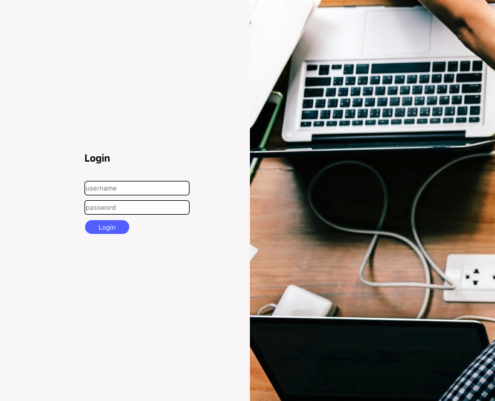
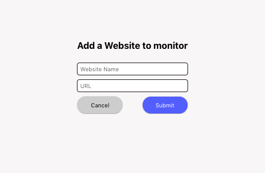
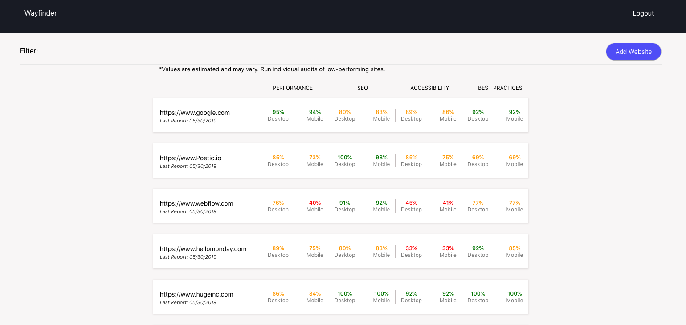

This project was bootstrapped with [Create React App](https://github.com/facebook/create-react-app).

# Wayfinder

Wayfinder is a React/Redux project built for <a href="https://poetic.io/">Poetic Systems</a>. This application is designed to monitor the health of client websites by headlessly fetching pertinent information via Google Chrome's Lighthouse tool. 

# Features 
HTML, CSS, JavaScript, React.js, Redux.js, Node.js, Sequelize, Heroku, GraphQL, Apollo, PostgreSQL

# Live Link

<a href="https://poetic-wayfinder-client.herokuapp.com/">Click Here</a>

**Login: ShaunC**
**Password: SCwayfinder**

# Project Contributors

Gregory Priznar, Tim Goens, Shaun Colley

# How it work

The application features secure login so the data is only accessible to verified users. After entering correct login credentials the user will be directed to the dashboard screen by clicking on the "Wayfinder" link in the menu. The dashboard displays the health statistics (Performance, SEO, Accessibility, Best Practices) for desktop and mobile versions of the website. You can add additional websites to monitor via the "Add Website" button. 
  
 **Cron Job** 

This application features a cron job which will automatically refresh the website statistics every 7 days. In order to manually view the updated statistics you'll need to hit the "Refresh Data" button at the bottom of the page. It currently takes an average of 15-30 seconds per website so please be patient as we have over 200 entries in our database so this will usually take about 2 hours to complete. 

**GraphQL**

GraphQL is a newer technology that we explored during this project. Many people have asked us, "what is GraphQL and why would we want to use this over a traditional RESTful API?". 

GraphQL is a query language and runtime that can be used to build and expose APIs as a strongly-typed schema instead of hundreds of REST endpoints. This allows for the user to retrieve only the requested pieces of data instead of the entire JSON. It's faster and more flexible which ultimately means less stress on your server. 

# Screenshots

**Login Screen**

**Add Website**

**Dashboard**

